# Hopes E-Learning Platform - Architecture Documentation

## High-Level Architecture Diagram

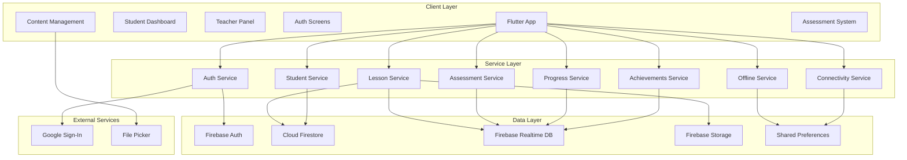

## User Flow Diagram

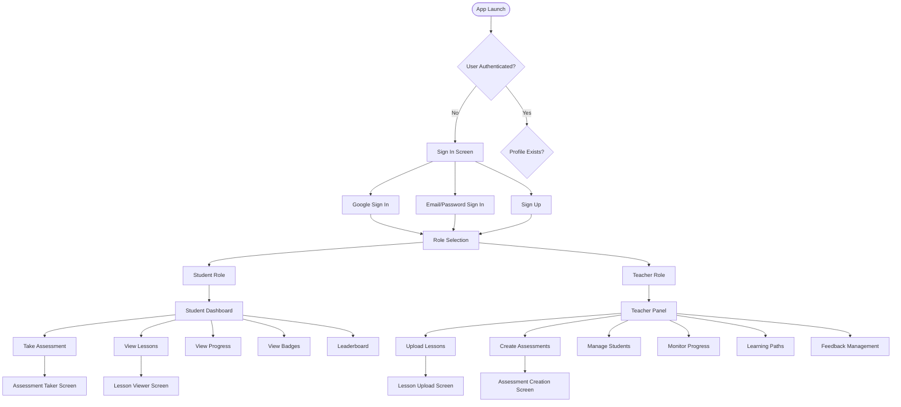

## Data Flow Diagram

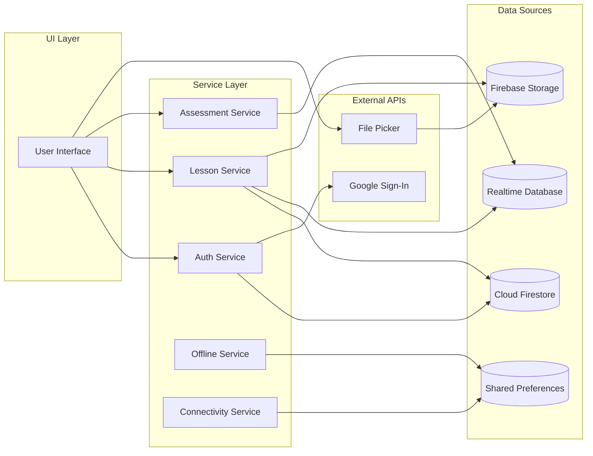

## Component Architecture

```mermaid
graph TB
    subgraph "Presentation Layer"
        A[Auth Wrapper]
        B[Sign In Screen]
        C[Role Selection Screen]
        D[Student Dashboard]
        E[Teacher Panel]
        F[Lesson Upload Screen]
        G[Assessment Creation Screen]
        H[Student Management Screen]
        I[Progress Monitoring Screen]
    end
    
    subgraph "Business Logic Layer"
        J[Auth Service]
        K[Lesson Service]
        L[Assessment Service]
        M[Student Service]
        N[Progress Service]
        O[Achievements Service]
        P[Offline Service]
        Q[Connectivity Service]
    end
    
    subgraph "Data Models"
        R[User Model]
        S[Lesson Model]
        T[Assessment Model]
        U[Student Model]
        V[Progress Model]
        W[Achievement Model]
    end
    
    subgraph "External Dependencies"
        X[Firebase Auth]
        Y[Cloud Firestore]
        Z[Realtime Database]
        AA[Firebase Storage]
        BB[Google Sign-In]
        CC[File Picker]
        DD[Shared Preferences]
    end
    
    A --> J
    B --> J
    C --> J
    D --> K
    D --> L
    D --> N
    D --> O
    E --> K
    E --> L
    E --> M
    E --> N
    F --> K
    G --> L
    H --> M
    I --> N
    
    J --> R
    K --> S
    L --> T
    M --> U
    N --> V
    O --> W
    
    J --> X
    J --> BB
    K --> Y
    K --> Z
    K --> AA
    L --> Z
    M --> Y
    N --> Z
    O --> Z
    P --> DD
    Q --> DD
    F --> CC
```

## State Management Flow

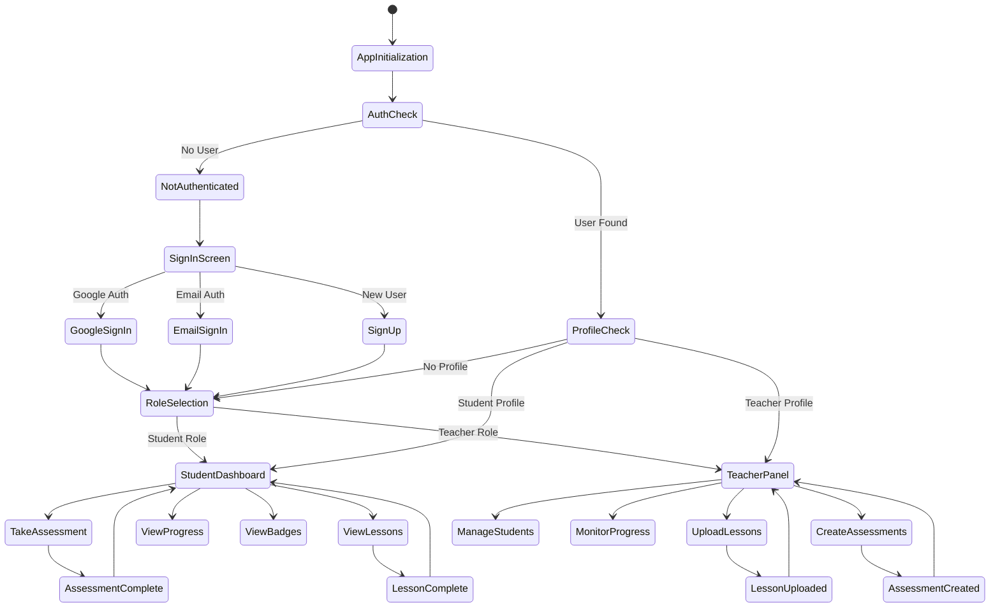

## Database Schema

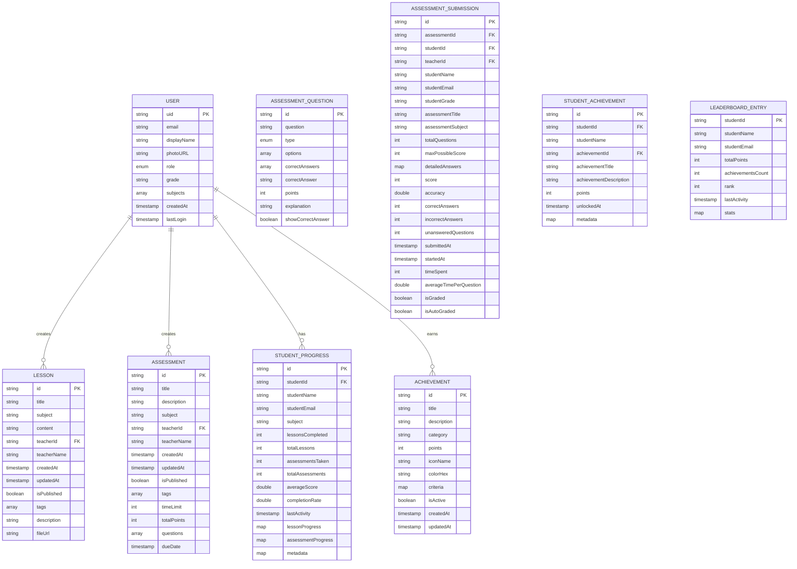

## Offline Architecture

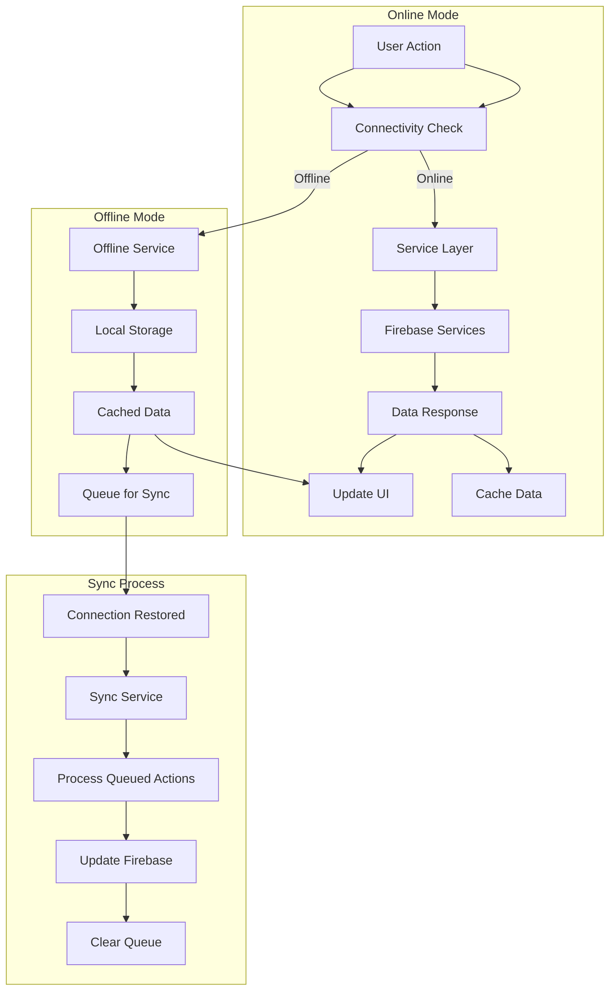

## Security Architecture

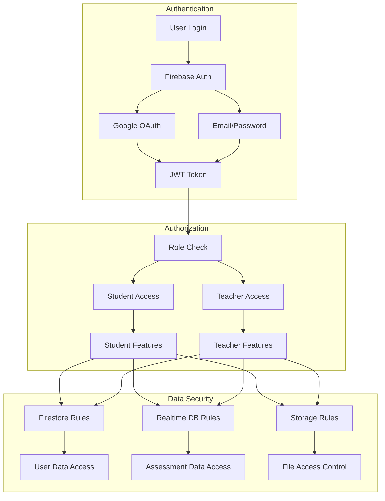

## Performance Optimization

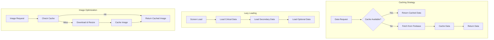

## Error Handling Flow

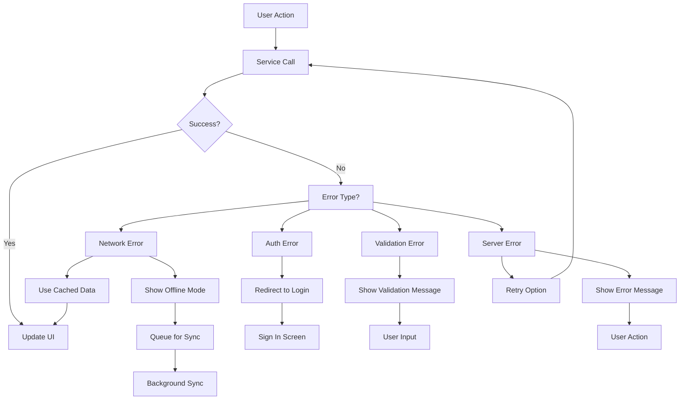

## Deployment Architecture

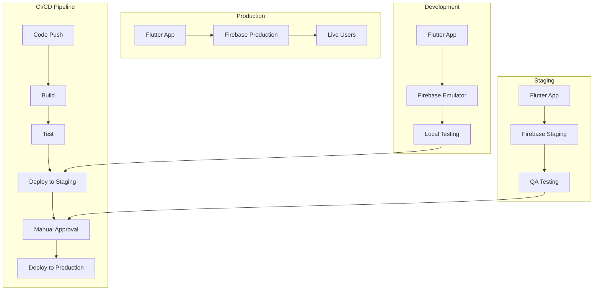

## Monitoring & Analytics

```mermaid
graph TB
    subgraph "User Analytics"
        A[User Actions] --> B[Firebase Analytics]
        B --> C[Usage Patterns]
        C --> D[Performance Metrics]
    end
    
    subgraph "Error Monitoring"
        E[App Errors] --> F[Firebase Crashlytics]
        F --> G[Error Reports]
        G --> H[Debug Information]
    end
    
    subgraph "Performance Monitoring"
        I[App Performance] --> J[Firebase Performance]
        J --> K[Load Times]
        K --> L[Network Requests]
    end
    
    subgraph "Custom Metrics"
        M[Learning Progress] --> N[Custom Analytics]
        N --> O[Student Performance]
        O --> P[Teacher Insights]
    end
```

## Key Features Architecture

### 1. Authentication System
- **Firebase Authentication** with Google OAuth and Email/Password
- **Role-based access control** (Student/Teacher)
- **Profile management** with grade and subject assignment
- **Offline authentication state** persistence

### 2. Content Management
- **Lesson creation and management** with file upload support
- **Assessment creation** with multiple question types
- **Learning path design** for structured learning
- **Content categorization** by subjects and tags

### 3. Student Learning Experience
- **Interactive lesson viewer** with file preview
- **Assessment taking system** with timer and progress tracking
- **Progress monitoring** with detailed analytics
- **Achievement system** with badges and leaderboard
- **Leaderboard with section filtering** for per-section rankings
- **Offline content access** with sync capabilities

### 4. Teacher Management Tools
- **Student management** with enrollment and progress tracking
- **Content creation tools** for lessons and assessments
- **Subject-based filtering** (assigned subjects only for non-admin teachers)
- **Analytics dashboard** with performance insights
- **Feedback system** for student engagement
- **Learning path assignment** and monitoring

### 5. Offline Capabilities
- **Local data caching** using SharedPreferences
- **Offline content access** for lessons and assessments
- **Sync queue management** for offline actions
- **Connectivity monitoring** with automatic fallback

### 6. Data Architecture
- **Cloud Firestore** for user profiles and lesson metadata
- **Firebase Realtime Database** for assessments and progress
- **Firebase Storage** for file uploads and media
- **SharedPreferences** for local caching and settings

## Student-Specific Architecture

```mermaid
graph TB
    subgraph "Student Interface Layer"
        A[Student Dashboard]
        B[Lesson Viewer Screen]
        C[Assessment Taker Screen]
        D[Progress Detail Screen]
        E[Badges Screen]
        F[Leaderboard Screen]
        G[Profile Edit Screen]
        H[Settings Screen]
    end
    
    subgraph "Student Services"
        I[Lesson Service]
        J[Assessment Service]
        K[Progress Service]
        L[Achievements Service]
        M[Submission Service]
        N[Auth Service]
    end
    
    subgraph "Student Data Models"
        O[User Model]
        P[Lesson Model]
        Q[Assessment Model]
        R[Assessment Submission]
        S[Student Progress]
        T[Achievement Model]
        U[Leaderboard Entry]
    end
    
    subgraph "Student Data Sources"
        V[Cloud Firestore - User Profile]
        W[Realtime DB - Lessons]
        X[Realtime DB - Assessments]
        Y[Realtime DB - Submissions]
        Z[Realtime DB - Progress]
        AA[Realtime DB - Achievements]
        BB[Firebase Storage - Files]
        CC[Shared Preferences - Cache]
    end
    
    A --> I
    A --> J
    A --> K
    A --> L
    B --> I
    C --> J
    C --> M
    D --> K
    E --> L
    F --> L
    G --> N
    H --> N
    
    I --> P
    J --> Q
    M --> R
    K --> S
    L --> T
    L --> U
    N --> O
    
    I --> W
    I --> BB
    J --> X
    J --> BB
    M --> Y
    K --> Z
    L --> AA
    N --> V
    N --> CC
    B --> BB
    C --> BB
```

## Teacher-Specific Architecture

```mermaid
graph TB
    subgraph "Teacher Interface Layer"
        A[Teacher Panel]
        B[Lesson Upload Screen]
        C[Lesson Library Screen]
        D[Assessment Creation Screen]
        E[Assessment Management Screen]
        F[Student Management Screen]
        G[Monitor Progress Screen]
        H[Learning Path Creation Screen]
        I[Learning Path Management Screen]
        J[Learning Path Assignment Screen]
        K[Feedback Management Screen]
        L[Teacher Submission Viewer Screen]
        M[Leaderboard Screen]
        N[Offline Settings Screen]
    end
    
    subgraph "Teacher Services"
        O[Auth Service]
        P[Lesson Service]
        Q[Assessment Service]
        R[Student Service]
        S[Progress Service]
        T[Learning Path Service]
        U[Feedback Service]
        V[Submission Service]
        W[Teacher Dashboard Service]
        X[Offline Service]
        Y[Connectivity Service]
    end
    
    subgraph "Teacher Data Models"
        Z[User Model]
        AA[Lesson Model]
        BB[Assessment Model]
        CC[Student Model]
        DD[Student Progress]
        EE[Learning Path Model]
        FF[Feedback Model]
        GG[Assessment Submission]
        HH[Teacher Activity]
    end
    
    subgraph "Teacher Data Sources"
        II[Cloud Firestore - User Profile]
        JJ[Cloud Firestore - Lessons]
        KK[Realtime DB - Assessments]
        LL[Realtime DB - Students]
        MM[Realtime DB - Progress]
        NN[Realtime DB - Learning Paths]
        OO[Realtime DB - Feedback]
        PP[Realtime DB - Submissions]
        QQ[Firebase Storage - Files]
        RR[Shared Preferences - Cache]
    end
    
    A --> O
    A --> W
    B --> P
    C --> P
    D --> Q
    E --> Q
    F --> R
    G --> S
    H --> T
    I --> T
    J --> T
    K --> U
    L --> V
    M --> W
    N --> X
    N --> Y
    
    O --> Z
    P --> AA
    Q --> BB
    R --> CC
    S --> DD
    T --> EE
    U --> FF
    V --> GG
    W --> HH
    
    O --> II
    P --> JJ
    P --> QQ
    Q --> KK
    R --> LL
    S --> MM
    T --> NN
    U --> OO
    V --> PP
    W --> RR
    X --> RR
    Y --> RR
```

## Student Learning Flow Architecture

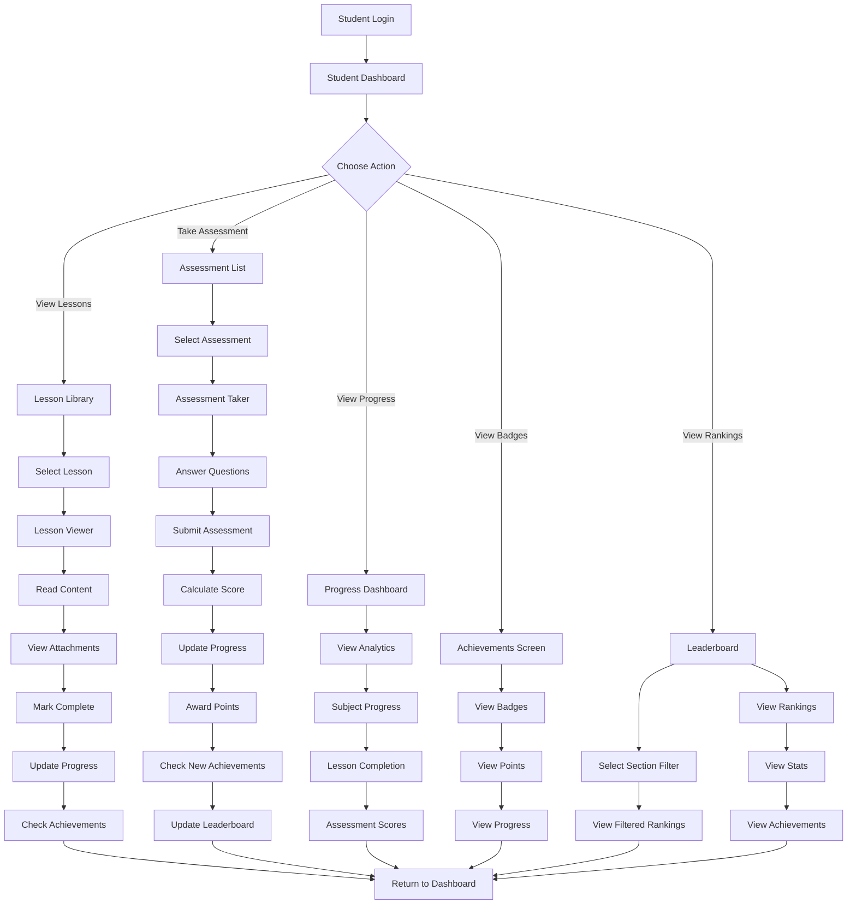

## Teacher Management Flow Architecture

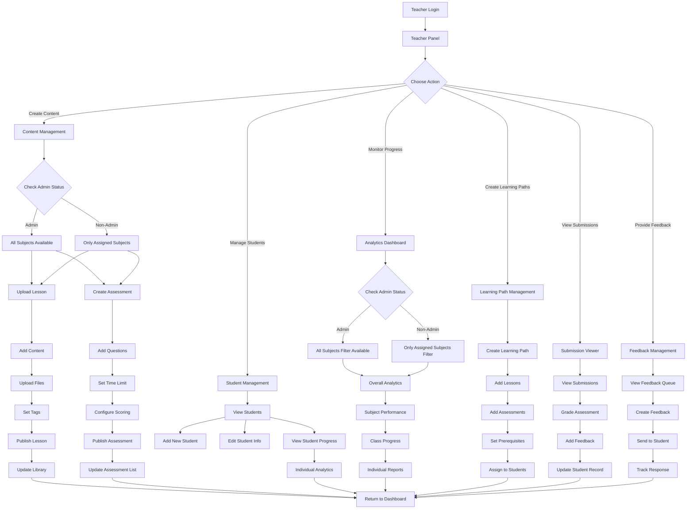

## Student Data Flow Architecture

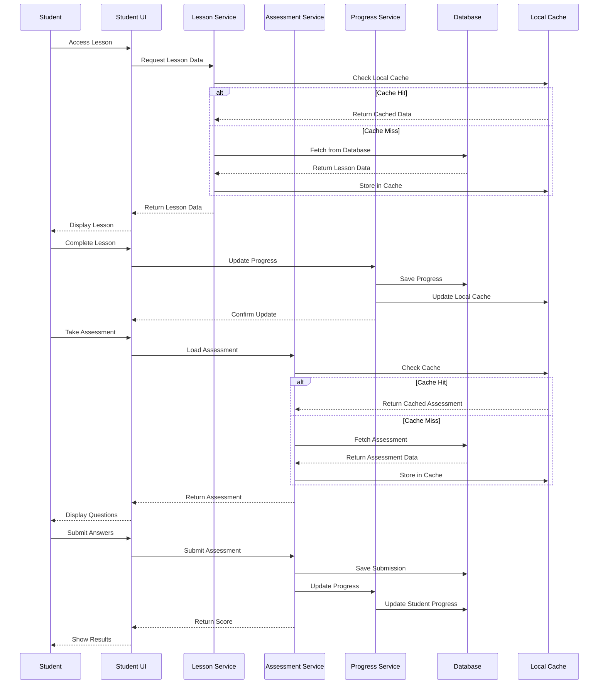

## Teacher Data Flow Architecture

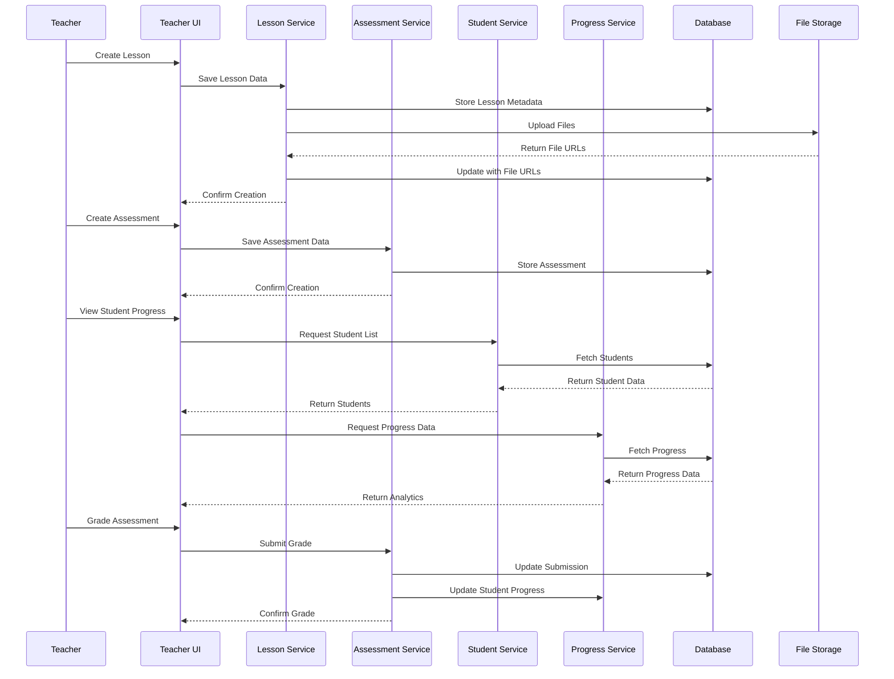

This architecture provides a robust, scalable, and offline-capable e-learning platform specifically designed for Grade 7 students and teachers in the Philippines.
